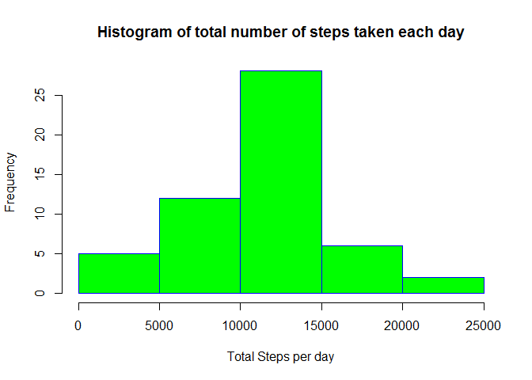
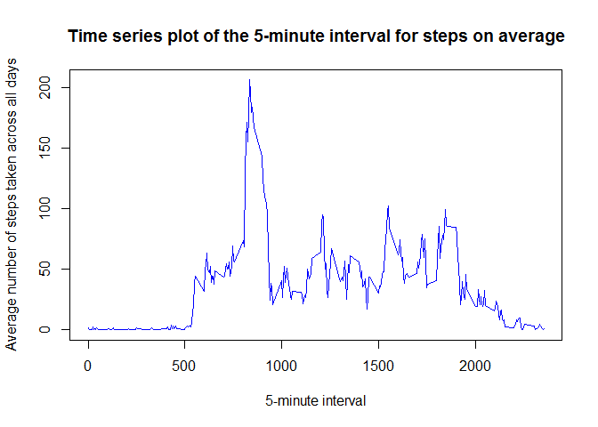
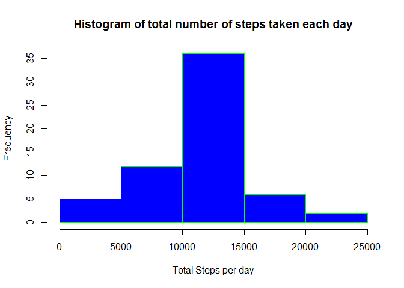
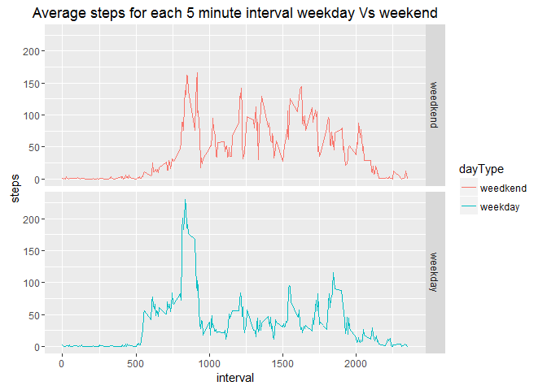

# Reproducible Research: Peer Assessment 1

## Loading and preprocessing the data

Load the data.

```r
allActivity <- read.csv(file = "activity.csv", header = TRUE)
```

Process/transform the data - remove 'NA' values from rows.

```r
activity <- allActivity[complete.cases(allActivity),]
```

## What is mean total number of steps taken per day?

Calculate the total number of steps taken per day.

```r
totalSteps <- aggregate(steps ~ date , activity, sum)
```

Make a histogram of the total number of steps taken each day.

```r
hist(totalSteps$steps, main="Histogram of total number of steps taken each day"
     , xlab = "Total Steps per day"
     , border = "blue"
     , col = "green")
```



Mean of the total number of steps taken per day.

```r
mean(totalSteps$steps)
```

```
## [1] 10766.19
```

Median of the total number of steps taken per day.

```r
median(totalSteps$steps)
```

```
## [1] 10765
```

## What is the average daily activity pattern?

Average daily activity pattern - for each 5 minute interval.

```r
stepInterval <- aggregate(steps ~ interval , activity, mean)
```

Time series plot of the 5-minute interval (x-axis) and average number of steps 
taken across all days (y-axis).

```r
plot(stepInterval$interval, stepInterval$steps, type = "l"
     , xlab = "5-minute interval"
     , ylab = "Average number of steps taken across all days"
     , main = "Time series plot of the 5-minute interval for steps on average"
     , col = "blue")
```



Which 5-minute interval, on average across all the days in the dataset, 
contains the maximum number of steps?

```r
stepInterval[which.max(stepInterval$steps),]$interval
```

```
## [1] 835
```

## Imputing missing values

Calculate and report the total number of missing values in the dataset 
(i.e. the total number of rows with NAs)?

```r
sum(is.na(allActivity))
```

```
## [1] 2304
```

Create a new dataset that is equal to the original dataset but with the.
missing data filled in using the mean for each 5 minute interval(stepInterval).

```r
activityFill <- allActivity
```


```r
#For each row
for(i in 1:nrow(activityFill)){
        #If steps is 'NA'
        if(is.na(activityFill$steps[i])) {
                #First get the interval value where the step is missing
                interval <- activityFill$interval[i]
                #Retrieve the mean step from stepInterval for current interval in loop
                meanSteps <- stepInterval[stepInterval$interval == interval ,]
                activityFill$steps[i] = meanSteps$steps
        }
}
```

Calculate the total number of steps taken per day.

```r
totalStepsImp <- aggregate(steps ~ date , activityFill, sum)
```

Make a histogram of the total number of steps taken each day.

```r
hist(totalStepsImp$steps
     , main="Histogram of total number of steps taken each day"
     , xlab = "Total Steps per day"
     , border = "green"
     , col = "blue")
```



Mean of the total number of steps taken per day.

```r
mean(totalStepsImp$steps)
```

```
## [1] 10766.19
```

Median of the total number of steps taken per day.

```r
median(totalStepsImp$steps)
```

```
## [1] 10766.19
```

## Are there differences in activity patterns between weekdays and weekends? 

Change the date column to type 'Date'.

```r
activityFill$date <- as.Date(activityFill$date, format = "%m/%d/%Y")
```

Create a new factor variable in the dataset with two levels "weekday" and
"weekend" indicating whether a given date is a weekday or weekend day.

```r
activityFill$dayType <- ifelse(weekdays(activityFill$date) 
                               %in% c("Saturday","Sunday")
                               ,"weedkend", "weekday")
activityFill$dayType <- as.factor(activityFill$dayType)
avgByDay <- aggregate(steps ~ interval+dayType , activityFill, mean)
```

Make a panel plot containing a time series plot (i.e. type = "l") of the 5-minute interval (x-axis) and the average number of steps taken, averaged across all weekday days or weekend days (y-axis). 


```r
#Load ggplot2 library
library(ggplot2)

ggplot(avgByDay, aes(x = interval, y = steps,color=dayType)) + geom_line() + 
        facet_grid(dayType ~ .) + 
        ggtitle("Average steps for each 5 minute interval weekday Vs weekend")
```


